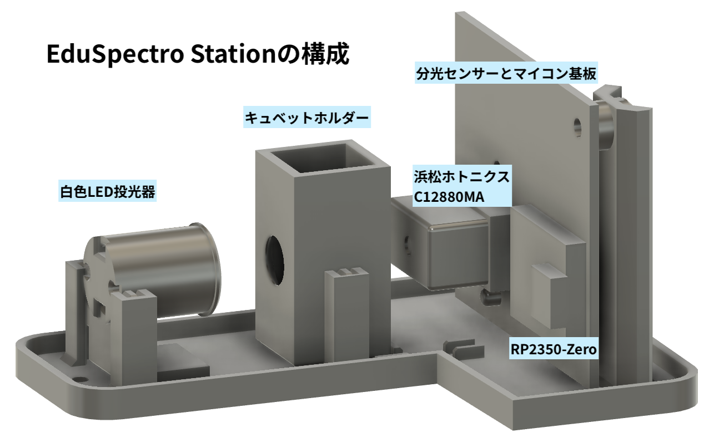
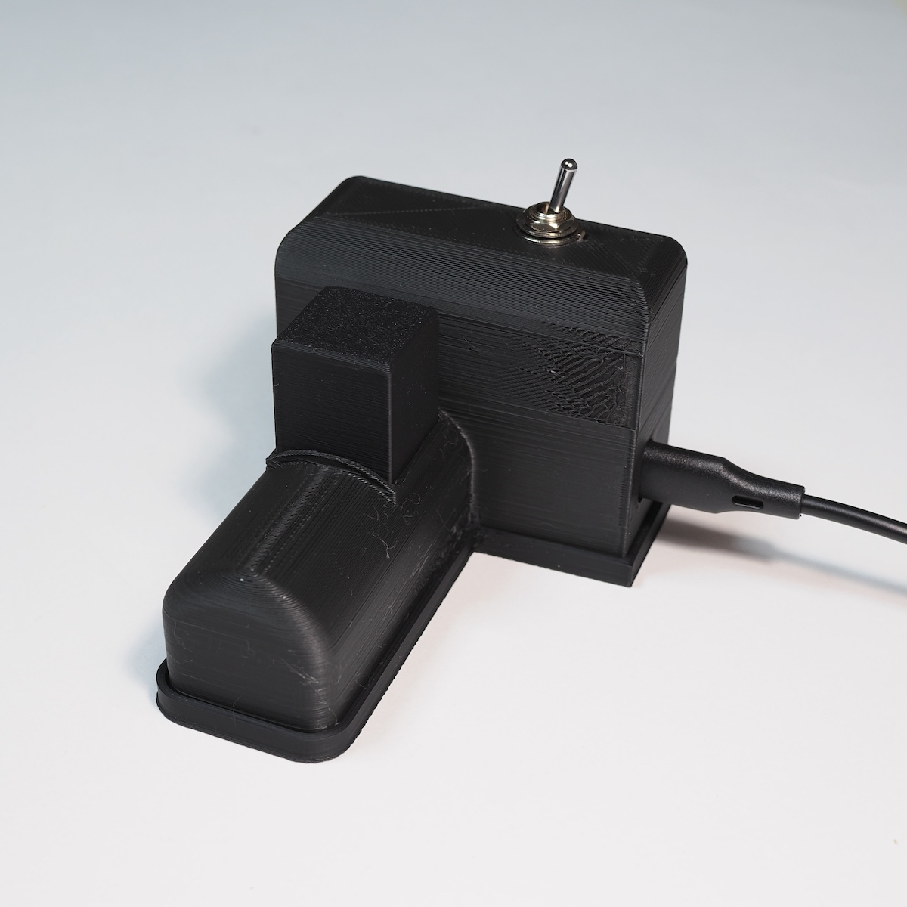
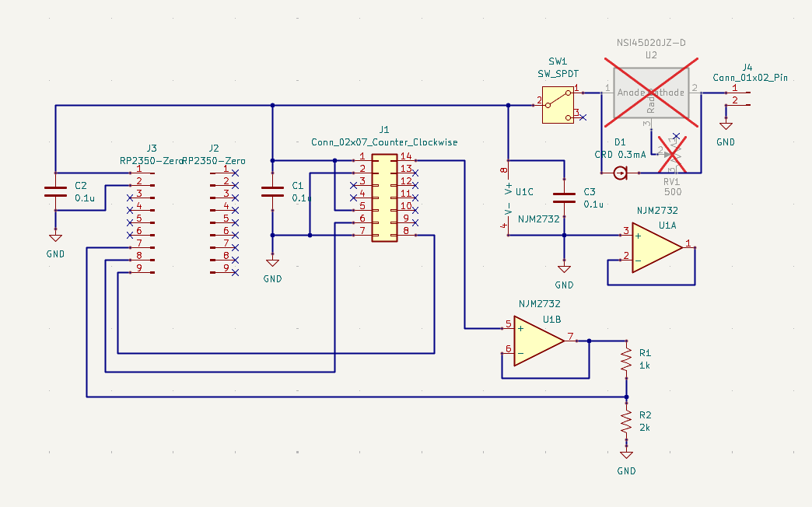

# EduSpectro 公式ガイド 🌈

「高校の理科室に、当たり前のように分光器を」

EduSpectroプロジェクトの公式ドキュメントサイトへようこそ！
このサイトでは、自作分光器の作り方から、授業での活用方法まで詳しく解説します。

## はじめに
分光器は「光を分ける」だけでなく、その背後にある物質の性質を読み取るツールです。スペクトルを目視で定性的に観察するだけではなく、データに基づいて現象を深く理解することができます。
### 分光器を自作？
浜松ホトニクス社の分光センサー **C12880MA** は高度な半導体製造技術により340〜850nmの波長を15nmの分解能で測定することができます。**EduSpectro4X** は、この分光センサーと高機能なマイコンRP2350を使用することで高度な光学設計を行うことなく、安定的に分光データを出力することができます。透過や吸収を測定する場合は、光源、サンプル、分光センサーのスリットを正確に配置する必要がありますのでそれらを一体的に収めた装置が必要となります。**EduSpectroStation** はコンパクトな白色半導体投光器を内蔵し遮光に配慮して設計した分光光度計です。
電子工作レベルの知識と3Dモデリングで分光器が自作できるのです。
 

 
### EduSpectro Lab
分光データの取得と解析はProcessingというプログラム言語で作成した**EduSpectroLab** を使用します。Windows, Mac, Linux問わず使用することができます。露光時間の制御、繰り返し測定による平均化とピクセル方向の移動平均などのデータ処理、参照データのオーバーレイや透過・吸収測定での誤差の大きい波長領域の表示機能といった測定支援も行います。
 

 
### オープンソース
回路図、マイコンのファームウェア(Arduino IDE)、3Dモデル(STLファイル)、測定解析プログラム(Processing)は各リポジトリにMITライセンスと記載しています。無保証ですが、自由にカスタマイズしてお使いください。
 
 
 
## EduSpectro4Xについて
PCにUSBで接続し、露光時間設定とデータコマンドを受け、データを出力します。EduSpectroLabはProcessingプログラムで書かれていますが、他の言語でもシリアル入出力ができるものであれば通信が可能です。
回路について簡単な説明を行い、その後、RP2350のプログラムについて説明します。
 
### 回路の概説
分光器の中核は分光センサーC12880MAです。仕様については
[浜松ホトニクスのWebサイト](https://www.hamamatsu.com/jp/ja/product/optical-sensors/spectrometers/mini-spectrometer/C12880MA.html)
をご覧ください。
RP2350マイコンから200kHzのクロックパルスと測定ごとのスタートパルスを入力すると、ビデオ端子から0-5Vの分光データを出力します。ビデオ端子の消費電流を抑えるためにバッファアンプを使用します。バッファアンプから抵抗で分圧してRP2350マイコンの12ビットADCに入力しています。
透過・吸収測定に使用する白色LEDは販売終了となっている豊田合成の手持ち在庫を使用しています。無くなり次第Seoul Semiconductor Inc.の「LED SUNLIKE COOL WHT 5000K 3030」に変更予定です。定電流素子を使用して光量の安定化を図っています。
 

 
### RP2350プログラムの概説
RP2350はラズベリーパイ財団が開発したマイコンで前世代のRP2040でバグのあった12ビットのアナログ入力の精度が改善されています。また、PIOというCPUを介さずに高速かつ正確なタイミングでI/Oピンを制御できるハードウェアを備えています。この機能を使って分光センサー用のクロックパルスを作成しています。
10回累積計測して出力することでノイズの軽減を行なっています。また、分光センサーC12880MAは288画素ですが、Catmull-Rom3次補間により本来のサンプリング点（4点に1点の生データ）を維持しつつ、視覚的に自然で、ピーク位置を特定しやすい 1149 点のデータを生成します。

 

 

### 通信プロトコル（他言語開発用）
PythonやC#、LabVIEWなど、他のプログラミング言語でも本機を制御できるように、通信仕様を公開します。
シリアル設定: 230,400 bps / 8-bit / parity none / stop bit 1
制御コマンド: (テキスト形式、末尾に \n)
send: 計測を開始し、データを1パケット返送するように要求します。
exp:xxxx: 露光時間を xxxx ミリ秒に設定します。 （例: exp:1000 で1秒）
データ形式 (Binary Packet):
本機は1パケットにつき以下の構成でデータを送出します。
1. Header (4 bytes): 0x00, 0x00, 0xFF, 0xFF
2. Payload (2298 bytes): 1149点のデータ。各点は 16bit 符号なし整数 (Little Endian)。
3. Footer (4 bytes): 0x0F, 0x0F, 0x0F, 0x0F
 
 
 
## EduSpectroLabについて

- [組み立てガイド（準備中）](#)
- [アプリの使い方（準備中）](#)

## 活用事例
- 植物の葉のスペクトルを測る
- LEDライトの色を分析する
